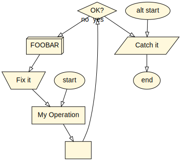

# Afl2

Copyright © 2015, 2019, 2022, by Christopher Alan Mosher, Shelton, Connecticut, USA, <cmosher01@gmail.com> https://mosher.mine.nu/ .

[](https://cmosher01.github.io/Afl2)
[](https://www.gnu.org/licenses/gpl.html)
[](https://www.paypal.com/cgi-bin/webscr?cmd=_s-xclick&hosted_button_id=CVSSQ2BWDCKQ2)

ANSI Flowchart Language 2.0: now, in Java.

---

### installation

Download the native installer for your platform from
https://github.com/cmosher01/Afl2/releases/latest and install it.

```shell
$ sudo dpkg -i ~/Downloads/afl2_VERSION-1_amd64.deb
```

### usage

Create a simple AFL file as input. The output file can
be displayed simply by using dotty from graphviz:

```shell
$ cat simple.afl
( start
[ _op My Operation
[
< _ok OK? - yes
/ _c Catch it
( end >

( alt start > _c

< _ok - no
| FOOBAR
` Fix it > _op


$ sudo apt install graphviz
$ /opt/afl2/bin/afl2 simple.afl | dotty -
```



See the [documentation](https://cmosher01.github.io/Afl2)
for the AFL syntax, and some more examples.
